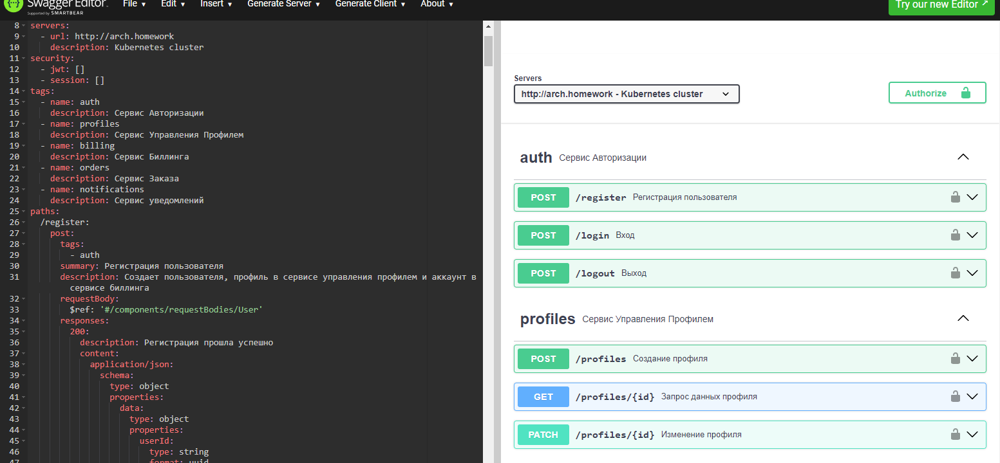
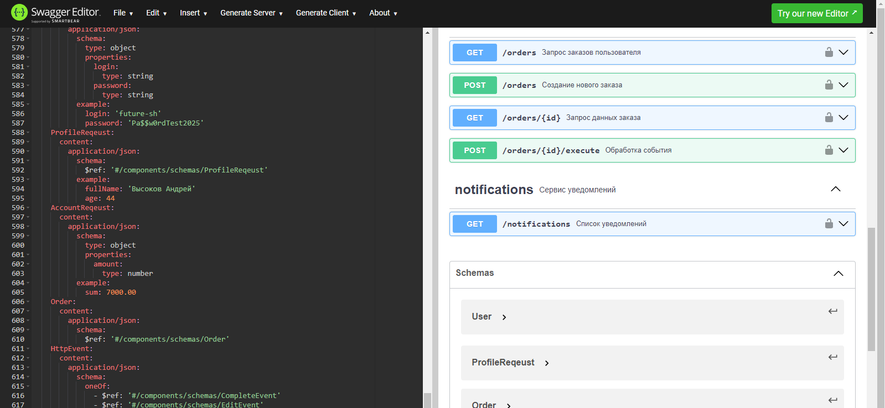
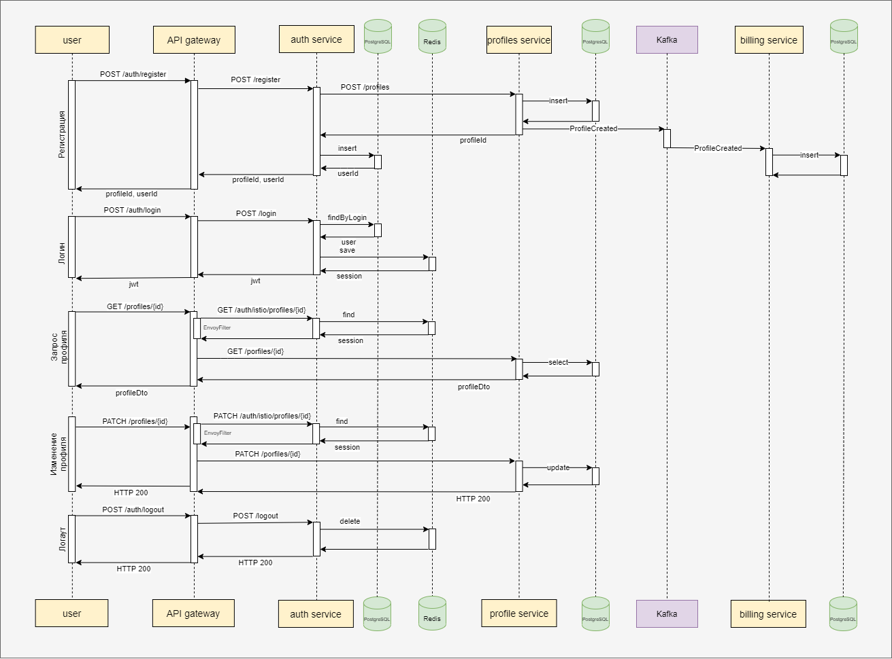
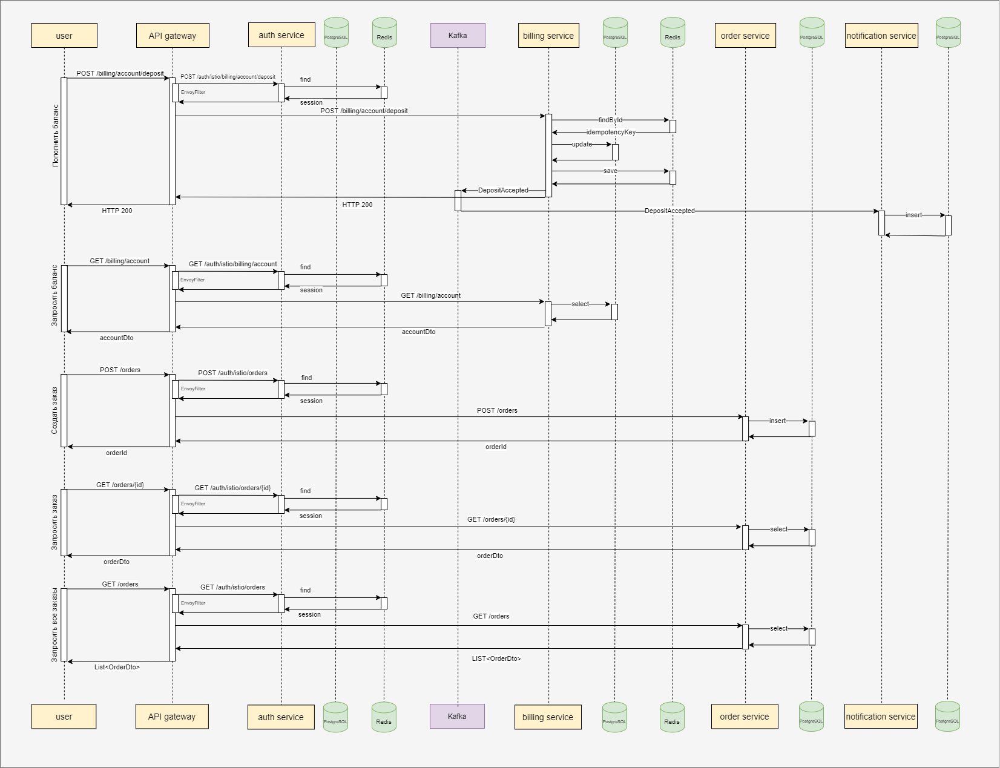
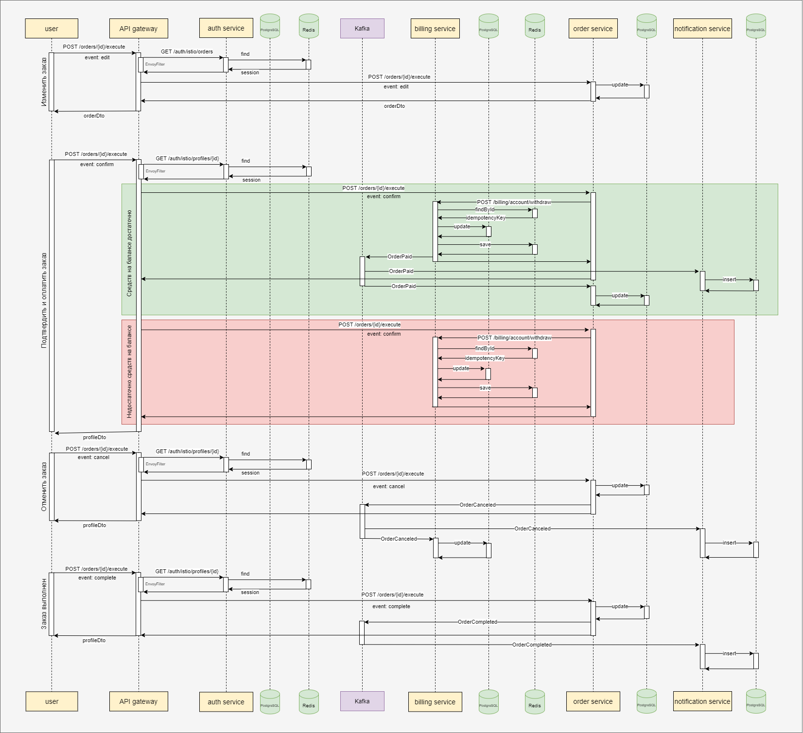
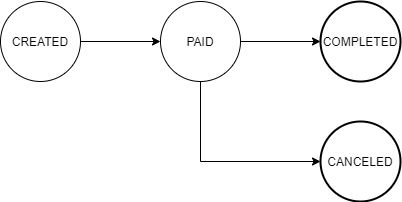

### Домашнее задание №1. Декомпозиция микросервисов

Задание. Предложить вариант разбиения приложения на микросервисы
предоставьте:
1. Пользовательские сценарии в свободном формате.
2. Общую схему взаимодействия сервисов в свободном формате.
3. Для каждого сервиса опишите назначение сервиса и его зону ответственности в свободном формате.
4. Опишите контракты взаимодействия сервисов друг с другом в свободном формате

---

#### Предметные области

- Пользователь
- Профиль  
- Заказ
- Счёт  
- Уведомление

#### Пользовательские сценарии

 Пользователь имеет возможность:
  - зарегистрироваться в веб-сервисе
  - авторизоваться в веб-сервисе
  - разлогиниться в веб-сервисе
  - просматривать и редактировать свой профиль
  - получить баланс своего счёта
  - пополнить баланс своего счёта
  - создать заказ
  - отменить заказ
  - редактировать неподтвержденный заказ
  - подтвердить заказ  
  - посмотреть детали заказа  
  - получать уведомления о заказах и пополнении счета

#### Системные действия

- Регистрация
- Авторизация
- Пополнение счёта
- Списание со счета  
- Создание заказа
- Изменение статуса заказа  
- Получение уведомлений

#### Сервисы

- Сервис Авторизации
- Сервис Управления Профилем
- Сервис Заказа
- Сервис Биллинга  
- Сервис Уведомлений

#### Спецификация OpenAPI
OpenAPI спефикация: [openapi.yaml](https://github.com/GUR-ok/otus-microservice-architecture/tree/master/hw7/openapi.yaml)

---

#### Схема взаимодействия

1 Регистрация, авторизация, упарвление профилем

2 Пополнить/запросить баланс, создать/получить заказ

3 Операции с заказом

---

### Сервис Авторизации

**Описание**

Сервис предоставляет API для авторизации пользователя: регистрация, логин, логаут.
При первичной регистрации обращается в Сервис Управления Профилем для создания профиля пользователя.
Сервис выдает и сохраняет в Redis токен авторизации jwt, подписанный приватным ключом,
а также предоставляет доступ к публичному ключу для валидации jwt в Istio.
Сервис предоставляет методы обработки запросов для Envoy фильтра Istio,
в частности валидирует jwt на наличие в базе данных активных токенов (в случае компрометации jwt может быть удален из БД и не пройдет валидацию)

**Запросы**

- `GET /api/v1/.well-known/jwks.json` — публичный ключ для валидации jwt

**Команды**

- `POST /api/v1/register` — регистрация нового пользователя
- `POST /api/v1/login` — логин
- `POST /api/v1/logout` — логаут
- `POST/GET/PATCH /api/v1/auth/istio/**` - фильтр запросов для Envoy фильтра Istio, валидация токена.

**События очередей**

- Отсутствует

**Проверка работоспособности**

- `GET /api/v1/health` — возвращает состояние сервиса

**Зависимости**

- Сервис Управления Профилем: вызыов метода создания профиля клиента `POST /api/v1/profiles`
- БД Redis для хранения jwt
- БД Postgres для хранения логин/пароля пользователя

---

### Сервис Управления Профилем

**Описание**

Сервис предоставляет возможность создавать и редактировать профиль пользователя

**Запросы**

- `GET /api/v1/profiles/{id}` — запрос профиля пользователя

**Команды**

- `POST /api/v1/profiles` — создание нового профиля
- `PATCH /api/v1/profiles/{id}` — редактирование профиля

**События очередей**

Сервис генерирует события:
- `ProfileCreated` — событие при успешном создании профиля

**Проверка работоспособности**

- `GET /api/v1/health` — возвращает состояние сервиса

**Зависимости**

- БД Postgres для хранения данных профиля пользователя

---

### Сервис Заказа

**Описание**

Сервис предоставляет API для работы с заказами. После создания заказа пользователь должен оплатить заказ.

Статусная модель заказа:

CREATED - новый заказ, может быть не полностью заполнен. Может редактироваться.
PAID - заказ успешно оплачен и принят в работу
CANCELED - заказ отменен. Если заказ оплачен, то средства будут возвращены
COMPLETED - заказ выполнен

**Запросы**

- `GET /api/v1/orders` — отображает все заказы пользователя
- `GET /api/v1/orders/{id}` — отображает детальную информацию по заказу

**Команды**

- `POST /api/v1/orders` — создание нового заказа
- `POST /api/v1/orders/{id}/execute` — обработка HttpEvent'ов, связанных с заказом,
  например изменение статуса заказа (в т.ч. отмена, подтверждение заказа, выполнение заказа), обогащение данными и др.

**События очередей**

Сервис генерирует события:
- `OrderCanceled` — событие при отмене заказа
- `OrderCompleted` — событие при успешном выполнении заказа

Сервис подписан на события:
- `OrderPaid` — событие при успешной оплате заказа

**Проверка работоспособности**

- `GET /api/v1/orders/health` — возвращает состояние сервиса

**Зависимости**

- Сервис Биллинга: вызывов метода списание денег со счёта пользователя `POST /api/v1/billing/account/withdraw`
- БД Postgres для хранения данных заказа

---

### Сервис Биллинга

**Описание**

Сервис предоставляет API для работы со счетом пользователя: создание счета, пополнение и списание, возврат средств при отмене заказа.
Операции внесения/списания/возврата средств идемпотентны.

**Запросы**

- `GET /api/v1/billing/account` — отображает состояние счёта (баланса)

**Команды**

- `POST /api/v1/billing/account/deposit` — пополнение баланса счёта пользователя
- `POST /api/v1/billing/account/withdraw` — списание денег со счёта пользователя

**События очередей**

Сервис генерирует события:
- `OrderPaid` — событие при успешной оплате заказа
- `DepositAccepted` — событие при успешном пополнении счета

Сервис подписан на события:
- `ProfileCreated` - событие при создании профиля. Для этого профиля создается новый account в биллинге.
- `OrderCanceled` — событие при отмене заказа

**Проверка работоспособности**

- `GET /api/v1/billing/health` — возвращает состояние сервиса

**Зависимости**

- БД Redis для хранения ключей идемпотентности
- БД Postgres для хранения данных счетов пользователей

---

### Сервис Уведомлений

**Описание**

Сервис предоставляет API для работы с уведомлениями

**Запросы**

- `GET /api/v1/notifications` — отображает все уведомления пользователя

**Команды**

- None

**События очередей**

Сервис подписан на события:
- `OrderPaid` — заказ оплачен
- `OrderCanceled` — событие при отмене заказа
- `OrderCompleted` — событие при успешном выполнении заказа
- `DepositAccepted` — событие при успешном пополнении счета

**Проверка работоспособности**

- `GET /api/v1/notifications/health` — возвращает состояние сервиса

**Зависимости**

- БД Postgres для хранения уведомлений