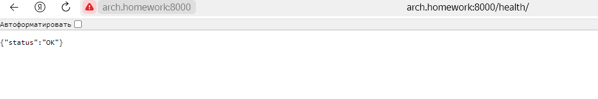

## ДЗ №2 Приложение в docker-образ и запушить его на Dockerhub
https://hub.docker.com/repository/docker/futureshaper/microservice-architecture-homeworks

##### Прописываем в C:\Windows\System32\drivers\etc\hosts 
127.0.0.1 arh.homework
##### Перезагружаем компьютер и проверяем ping arch.homework Если ок, то шаг 3
##### Создаем образ docker локально 
docker build --platform linux/amd64 -t hw02 .
##### Запускаем контейнер локально 
docker run -p 8000:80 hw02 Проверяем доступность в браузере. Если ок, то шаг 5
##### Присваиваем тег образу 
docker tag hw02 futureshaper/microservice-architecture-homeworks:hw02
##### Отправляем образ в docer hub    
docker push futureshaper/microservice-architecture-homeworks:hw02
##### Запускаем образ из docer hub    
docker run -p 8000:80 futureshaper/microservice-architecture-homeworks:hw02
##### Проверяем в доступность в браузере
http://arch.homework:8000/health 

    
   
   
