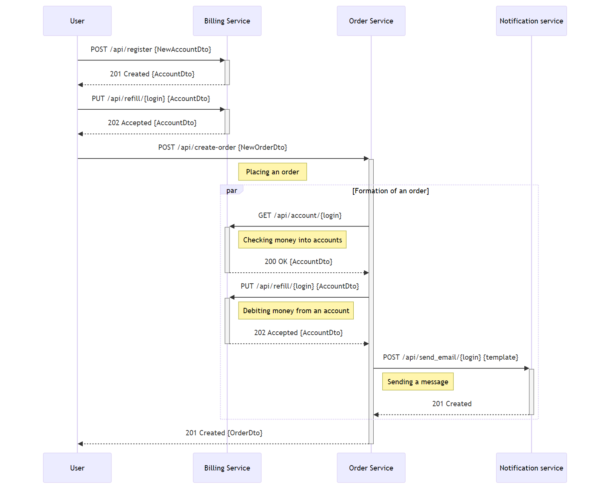
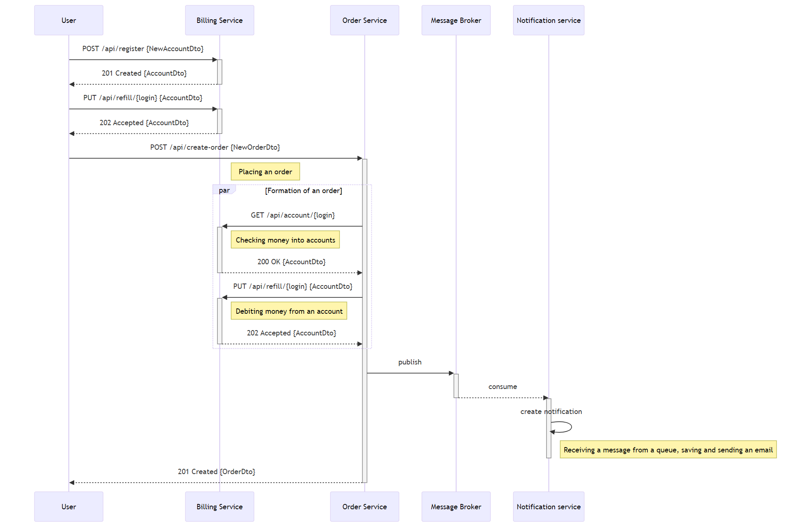
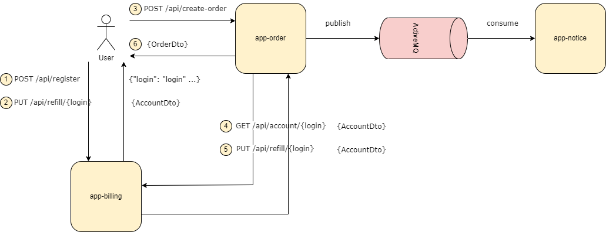
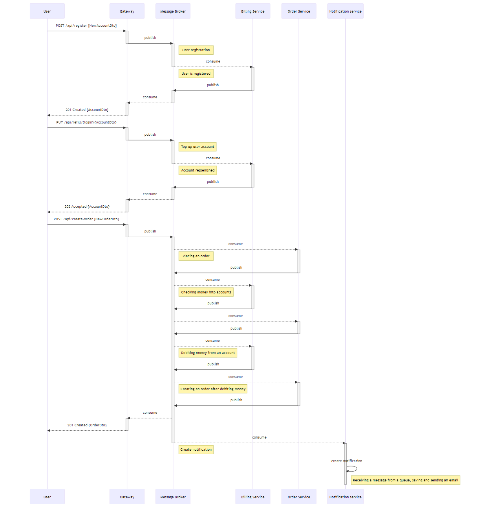

# Домашнее задание №7. Stream processing
## Сценарий:

- Создать пользователя. Должен создаться аккаунт в биллинге.
- Положить деньги на счет пользователя через сервис биллинга.
- Сделать заказ, на который хватает денег.
- Посмотреть деньги на счету пользователя и убедиться, что их сняли.
- Посмотреть в сервисе нотификаций отправленные сообщения и убедиться, что сообщение отправилось
- Сделать заказ, на который не хватает денег.
- Посмотреть деньги на счету пользователя и убедиться, что их количество не поменялось.
- Посмотреть в сервисе нотификаций отправленные сообщения и убедиться, что сообщение отправилось.

## RESTful
### Sequence диаграмма:

## Event Notifications (Выбрана в качестве реализации)
[Описание REST интерфейcов](https://petstore.swagger.io/?url=https://raw.githubusercontent.com/future-shaper/otus-microservice-architecture/main/hw07/README.assets/event-notifications-openapi.yaml)

### Sequence диаграмма:

### Схема взаимодействия сервисов:

## Event Collaboration
### Sequence диаграмма:

