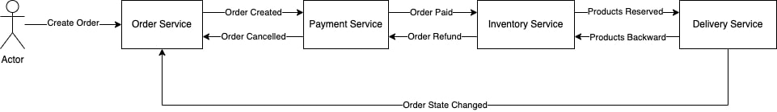

# ДЗ №8 Распределенные транзакции
### Описание

Для реализации используется паттерн сага
При создании заказа, проверяется:
- баланс на карте, достаточный для оплаты заказа
- доступность количества товаров на складе
- свободный курьер на слот доставки (слот = время заказа + 30 мин)

При любом отклони есть компенсирующие транзакции

Общение между сервисами реализовано через очереди



### Запуск проекта
```
kubectl apply -f ./infra/manifests
helm install rabbit ./infra/charts/rabitmq -n rmq
helm install order ./order/helm -n ms-order
helm install payment ./payment/helm -n ms-payment
helm install inventory ./inventory/helm -n ms-inventory
helm install delivery ./delivery/helm -n ms-delivery
```
### Запуск тестов

```
newman run ./otus-saga.postman_collection.json -e ./otus-api.postman_environment.json --verbose --delay-request 3000
```

baseUrl = arch.homework для изменения нужно отредактировать baseUrl в файле файл otus-api.postman_environment.json
